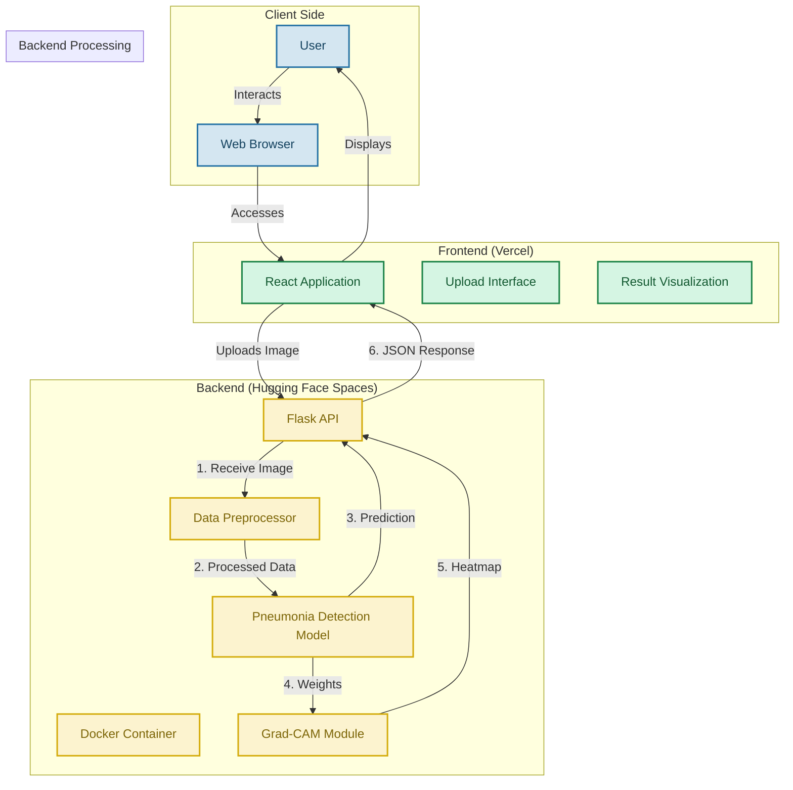

```mermaid
graph TD
    subgraph Client_Side ["Client Side"]
        User[User]
        Browser[Web Browser]
    end

    subgraph Frontend_Deployment ["Frontend (Vercel)"]
        ReactApp[React Application]
        UploadUI[Upload Interface]
        ResultView[Result Visualization]
    end

    subgraph Backend_Deployment ["Backend (Hugging Face Spaces)"]
        Docker[Docker Container]
        Flask[Flask API]
        Preprocessing[Data Preprocessor]
        Model[Pneumonia Detection Model]
        GradCAM[Grad-CAM Module]
    end

    User -->|Interacts| Browser
    Browser -->|Accesses| ReactApp
    ReactApp -->|Uploads Image| Flask
    
    subgraph Backend_Logic ["Backend Processing"]
        Flask -->|1. Receive Image| Preprocessing
        Preprocessing -->|2. Processed Data| Model
        Model -->|3. Prediction| Flask
        Model -->|4. Weights| GradCAM
        GradCAM -->|5. Heatmap| Flask
    end

    Flask -->|6. JSON Response| ReactApp
    ReactApp -->|Displays| User
    
    classDef client fill:#d4e6f1,stroke:#2874a6,stroke-width:2px,color:#154360;
    classDef frontend fill:#d5f5e3,stroke:#1e8449,stroke-width:2px,color:#145a32;
    classDef backend fill:#fcf3cf,stroke:#d4ac0d,stroke-width:2px,color:#7d6608;
    
    class User,Browser client;
    class ReactApp,UploadUI,ResultView frontend;
    class Docker,Flask,Preprocessing,Model,GradCAM backend;
```

## AI Generated Visual

