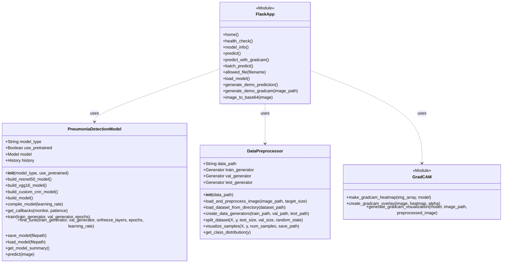

```mermaid
classDiagram
    class PneumoniaDetectionModel {
        +String model_type
        +Boolean use_pretrained
        +Model model
        +History history
        +__init__(model_type, use_pretrained)
        +build_resnet50_model()
        +build_vgg16_model()
        +build_custom_cnn_model()
        +build_model()
        +compile_model(learning_rate)
        +get_callbacks(monitor, patience)
        +train(train_generator, val_generator, epochs)
        +fine_tune(train_generator, val_generator, unfreeze_layers, epochs, learning_rate)
        +save_model(filepath)
        +load_model(filepath)
        +get_model_summary()
        +predict(image)
    }

    class DataPreprocessor {
        +String data_path
        +Generator train_generator
        +Generator val_generator
        +Generator test_generator
        +__init__(data_path)
        +load_and_preprocess_image(image_path, target_size)
        +load_dataset_from_directory(dataset_path)
        +create_data_generators(train_path, val_path, test_path)
        +split_dataset(X, y, test_size, val_size, random_state)
        +visualize_samples(X, y, num_samples, save_path)
        +get_class_distribution(y)
    }

    class FlaskApp {
        <<Module>>
        +home()
        +health_check()
        +model_info()
        +predict()
        +predict_with_gradcam()
        +batch_predict()
        +allowed_file(filename)
        +load_model()
        +generate_demo_prediction()
        +generate_demo_gradcam(image_path)
        +image_to_base64(image)
    }

    class GradCAM {
        <<Module>>
        +make_gradcam_heatmap(img_array, model)
        +create_gradcam_overlay(image, heatmap, alpha)
        +generate_gradcam_visualization(model, image_path, preprocessed_image)
    }

    FlaskApp ..> PneumoniaDetectionModel : uses
    FlaskApp ..> DataPreprocessor : uses
    FlaskApp ..> GradCAM : uses
```

## AI Generated Visual

