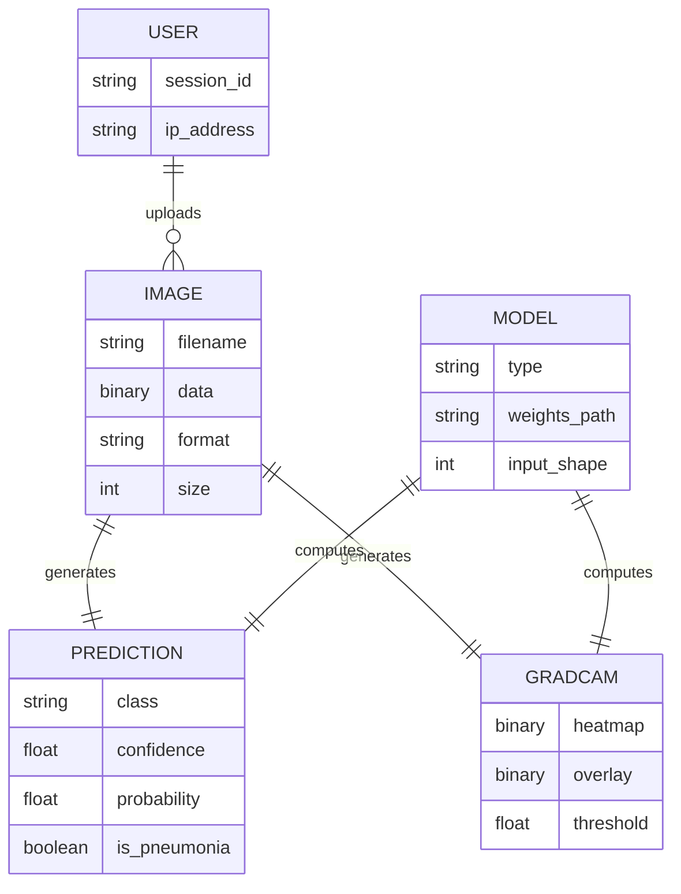

```mermaid
erDiagram
    USER ||--o{ IMAGE : uploads
    IMAGE ||--|| PREDICTION : generates
    IMAGE ||--|| GRADCAM : generates
    MODEL ||--|| PREDICTION : computes
    MODEL ||--|| GRADCAM : computes
    
    USER {
        string session_id
        string ip_address
    }
    
    IMAGE {
        string filename
        binary data
        string format
        int size
    }
    
    PREDICTION {
        string class
        float confidence
        float probability
        boolean is_pneumonia
    }
    
    GRADCAM {
        binary heatmap
        binary overlay
        float threshold
    }
    
    MODEL {
        string type
        string weights_path
        int input_shape
    }
```

## AI Generated Visual

