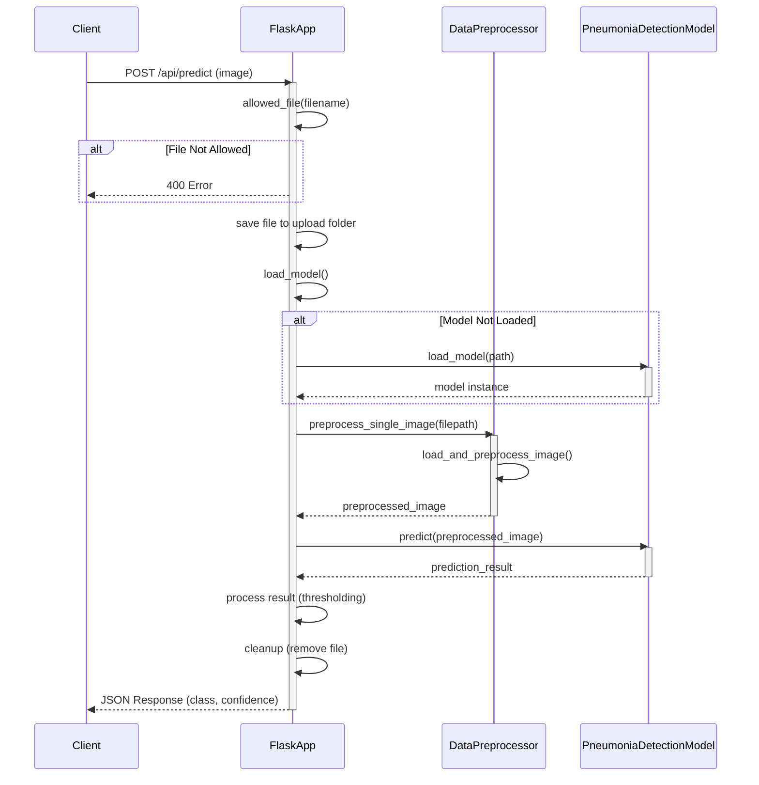

```mermaid
sequenceDiagram
    participant Client
    participant FlaskApp
    participant DataPreprocessor
    participant PneumoniaDetectionModel
    
    Client->>FlaskApp: POST /api/predict (image)
    activate FlaskApp
    
    FlaskApp->>FlaskApp: allowed_file(filename)
    alt File Not Allowed
        FlaskApp-->>Client: 400 Error
    end
    
    FlaskApp->>FlaskApp: save file to upload folder
    
    FlaskApp->>FlaskApp: load_model()
    alt Model Not Loaded
        FlaskApp->>PneumoniaDetectionModel: load_model(path)
        activate PneumoniaDetectionModel
        PneumoniaDetectionModel-->>FlaskApp: model instance
        deactivate PneumoniaDetectionModel
    end
    
    FlaskApp->>DataPreprocessor: preprocess_single_image(filepath)
    activate DataPreprocessor
    DataPreprocessor->>DataPreprocessor: load_and_preprocess_image()
    DataPreprocessor-->>FlaskApp: preprocessed_image
    deactivate DataPreprocessor
    
    FlaskApp->>PneumoniaDetectionModel: predict(preprocessed_image)
    activate PneumoniaDetectionModel
    PneumoniaDetectionModel-->>FlaskApp: prediction_result
    deactivate PneumoniaDetectionModel
    
    FlaskApp->>FlaskApp: process result (thresholding)
    FlaskApp->>FlaskApp: cleanup (remove file)
    
    FlaskApp-->>Client: JSON Response (class, confidence)
    deactivate FlaskApp
```

## AI Generated Visual

